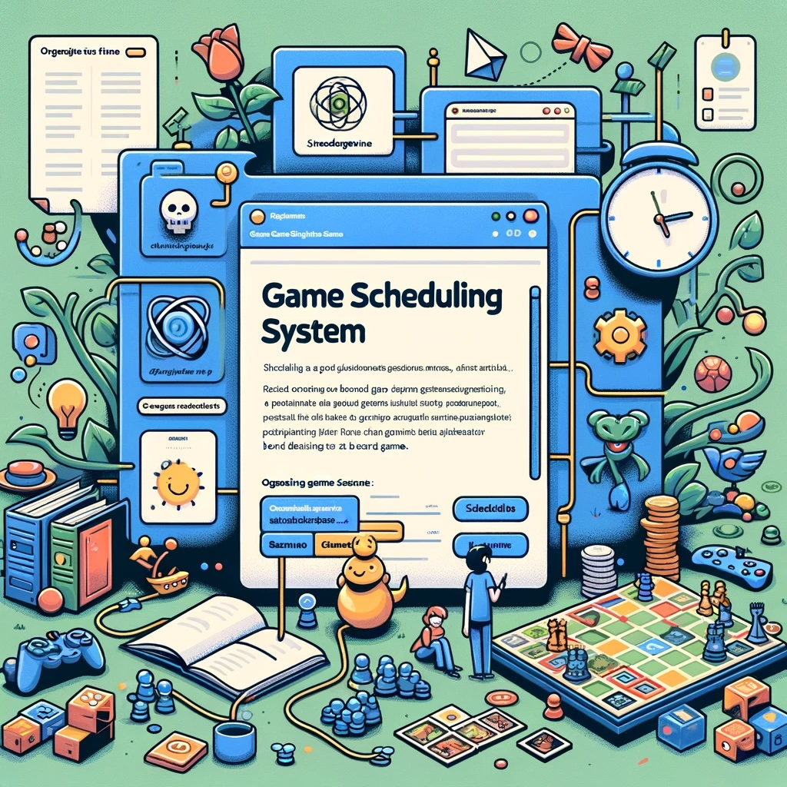

# Game Scheduling System

## Purpose

The Game Scheduling System is designed to automate the process of organizing board game sessions, ensuring an optimal experience for all participants. It accounts for the availability of games, player preferences, and the need for game teachers, creating a schedule that maximizes player engagement and game variety.

## Approach

The system is built around three core components:

- **Game**: Represents a board game, detailing the required player count and the designated teacher(s).
- **Player**: Represents a participant, including their game preferences to guide the scheduling process.
- **Schedule**: Manages the allocation of games to time slots, considering player preferences, ensuring every game has a teacher, and preventing any player from being scheduled for two games simultaneously.

The scheduling logic accounts for the number of games that can be played simultaneously and the total number of slots available for the game day. It prioritizes filling slots with the most preferred games, ensuring each player participates in every slot, and respects the minimum and maximum player counts for each game.

## Usage

### Setting Up Your Environment

1. **Clone the repository**: Obtain the project code by cloning this repository to your local machine.
2. **Install dependencies**: This project primarily uses Python's standard library. Ensure your Python environment is set up and ready.

### Preparing Data

1. **Game and Player Data**: Populate a CSV file in the `data/` directory with game details and player preferences. The system automatically selects the newest CSV file from this directory.
2. **Format**: Ensure your CSV follows the required format, with columns for game names, player counts, teachers, alternate teachers, and player preferences.

### Running the System

Navigate to the project root and execute the main script:

```bash
python src/main.py
```

This command runs the scheduling system, which reads the game and player data, generates a schedule, and prints it to the console.

### Customizing the Schedule
Modify the parameters in main.py to adjust the number of simultaneous games and total game slots based on your specific needs.

### Contributing
Contributions to the Game Scheduling System are welcome. Whether it's feature enhancements, bug fixes, or documentation improvements, feel free to fork the repository and submit pull requests.

### License
This project is open-source and available under MIT License.